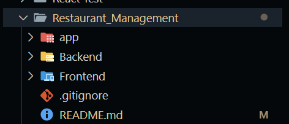

# 🍽️ Restaurant Management System

A full-stack restaurant management application built with **React (Vite)**, **Redux Toolkit**, **Express.js**, and **MongoDB**.  
It supports **dine-in** and **takeaway** workflows, dynamic menu browsing, cart management, and real-time order tracking.

---

## 🚀 Features

- 🧭 Category-based menu with infinite scroll and search  
- 🛒 Cart with quantity controls and global Redux state  
- 🧾 Order creation for dine-in (with table) or takeaway  
- ⏱️ Real-time order status updates (auto-mark as done)  
- 📱 Responsive UI with mobile-first design  
- 🌐 Deployed on **Render** (frontend + backend)

---

## 🧑‍💻 Tech Stack

| Layer | Technology Used |
|-------|-----------------|
| **Frontend** | React (Vite), Redux Toolkit |
| **Backend** | Node.js, Express.js |
| **Database** | MongoDB |
| **Deployment** | Render |

---

## 📁 Folder Structure

